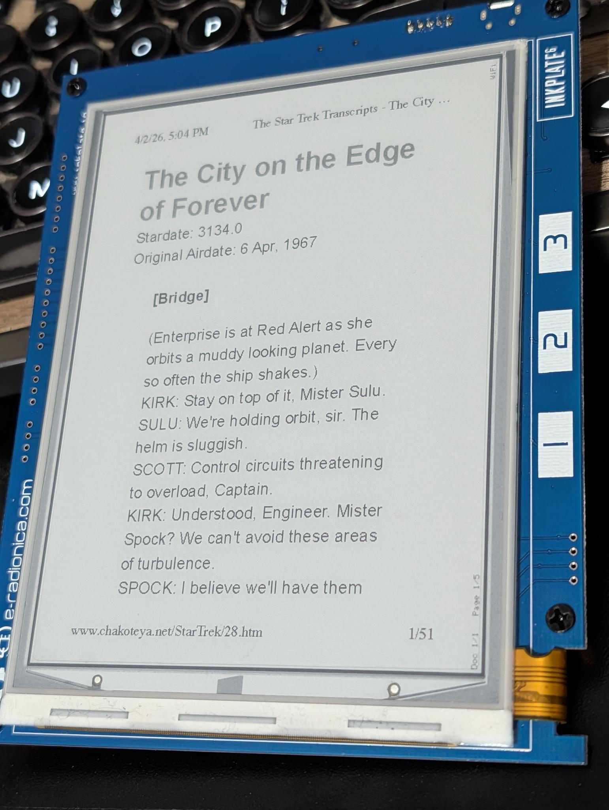

# Inkplate E-Ink Printer

Turn an [Inkplate 6](https://docs.soldered.com/inkplate/) into a wireless network printer. Print web pages, documents, and emails from any Mac or Windows computer — the Inkplate appears as a standard driverless printer on your network.



## How It Works

1. The Inkplate connects to your WiFi and advertises itself as an IPP (Internet Printing Protocol) printer via mDNS/Bonjour
2. Your computer discovers it in the printer list — no drivers needed
3. When you print, macOS/Windows renders the document to raster format and sends it over the network
4. The Inkplate receives the data, applies Floyd-Steinberg dithering for the e-ink display, and stores the pages on the SD card
5. Navigate between pages and documents using the three capacitive touchpads

## Supported Hardware

| Model | Display | Resolution | Color |
|-------|---------|------------|-------|
| **Inkplate 6** | 6" e-ink | 800 x 600 | 8-level grayscale |
| **Inkplate 6 Color** | 6" e-ink | 600 x 448 | 7 colors |

> **Inkplate 6 Color touchpad warning:** There are widespread reports of Inkplate 6 Color units shipping with non-functional or unreliable capacitive touchpads. Before flashing this project, test your touchpads using the library's built-in example: **File → Examples → InkplateLibrary → Inkplate6COLOR → Basic → Inkplate6COLOR_Read_Touchpads**. If not all three pads respond, you will not be able to navigate between pages/documents. The Inkplate 6 (mono) does not have this issue.

## Features

- **Driverless printing** from Mac (IPP Everywhere / AirPrint) and Windows
- **WiFi setup** via captive portal — no hardcoded credentials
- **Multi-page documents** stored on SD card
- **Touch navigation** — previous page, next page, next document
- **Document deletion** — hold all three touchpads for 3 seconds
- **Auto-scaling** — any page size (Letter, A4, custom) is scaled to fit the display with correct aspect ratio
- **Portrait rendering** — pages are rotated 90° for best use of the landscape display
- **Floyd-Steinberg dithering** for high-quality grayscale (or 7-color palette on Color model)
- **Automatic storage management** — oldest documents are deleted when the SD card fills up

## Quick Start

See the full **[Getting Started Guide](docs/index.html)** for detailed instructions.

**Requirements:**
- Inkplate 6 or Inkplate 6 Color
- FAT32-formatted micro SD card
- Arduino IDE 1.8+ with Inkplate board package installed
- USB cable for initial programming

**Summary:**
1. Install the Inkplate board package in Arduino IDE
2. Open `inkplate_print.ino`
3. Select your board model in `config.h`
4. Upload to the Inkplate
5. Connect to the `Inkplate-Setup` WiFi network and enter your WiFi credentials
6. Add the printer on your computer

## Configuration

Edit `config.h` before uploading:

```c
// Uncomment ONE line for your hardware:
#define INKPLATE_MODEL_MONO    // Inkplate 6 (800x600, grayscale)
// #define INKPLATE_MODEL_COLOR   // Inkplate 6 Color (600x448, 7-color)

// Printer name (appears in your computer's printer list):
#define PRINTER_NAME  "Inkplate-printer"
```

## Touch Controls

| Pad | Action |
|-----|--------|
| **Pad 1** (left) | Previous page |
| **Pad 2** (center) | Next page |
| **Pad 3** (right) | Next document |
| **All three** (hold 3s) | Delete current document |

## Project Structure

```
inkplate_print/
├── inkplate_print.ino    # Main sketch
├── config.h              # Hardware & printer configuration
├── hardware.h/cpp        # Inkplate display/touchpad/SD abstraction
├── wifi_manager.h/cpp    # WiFi connection & captive portal
├── ipp_server.h/cpp      # IPP protocol server & chunked HTTP
├── ipp_protocol.h/cpp    # IPP binary message encoding
├── pwg_parser.h/cpp      # Apple Raster (URF) & PWG Raster parser
├── sd_storage.h/cpp      # Document storage on SD card
├── display.h/cpp         # E-ink rendering with 90° rotation
├── navigation.h/cpp      # Touch input & document navigation
└── docs/                 # Getting started guide
```

## How Printing Works (Technical)

The Inkplate implements a minimal IPP (Internet Printing Protocol) server:

1. **Discovery**: mDNS advertises `_ipp._tcp` with IPP Everywhere attributes
2. **Capabilities**: Get-Printer-Attributes returns supported formats, media size, and resolution
3. **Print jobs**: CUPS/Windows sends documents as Apple Raster (URF) or PWG Raster via HTTP POST with chunked transfer encoding
4. **Parsing**: The URF/PWG stream is decoded (reversed PackBits for URF), scaled to fit the display, and dithered
5. **Storage**: Each page is stored as a raw pixel file on the SD card
6. **Display**: Pages are rendered rotated 90° (portrait content on landscape display)

## License

MIT
